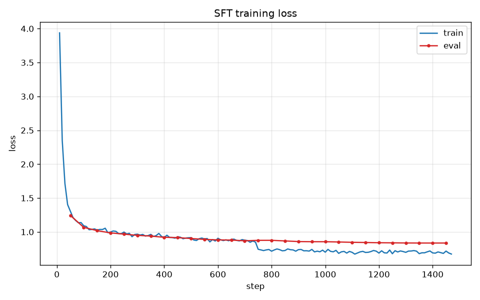
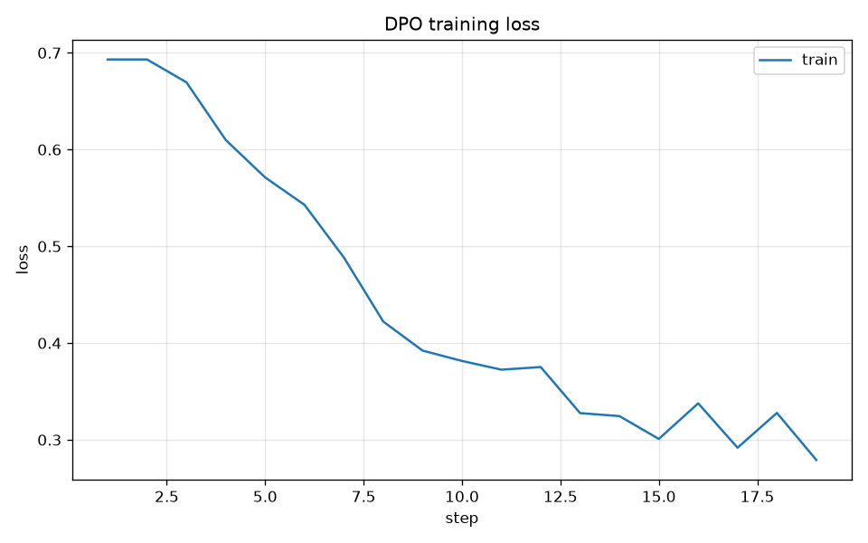
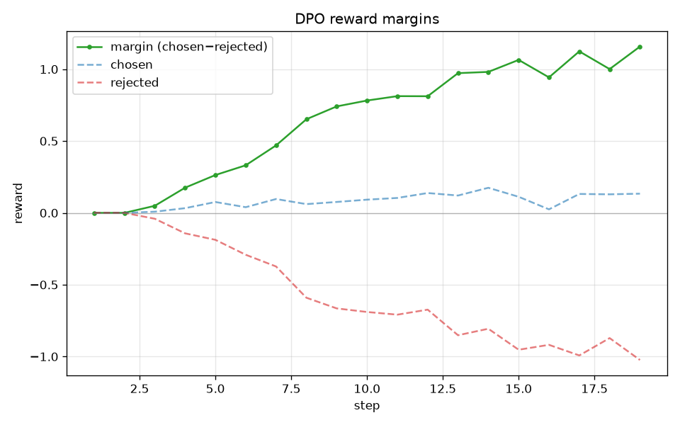
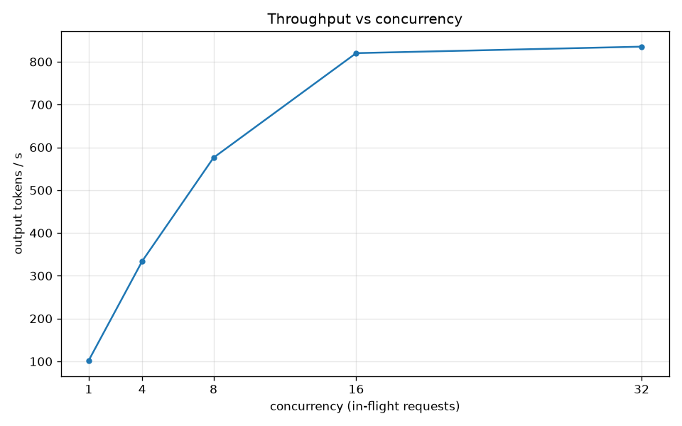
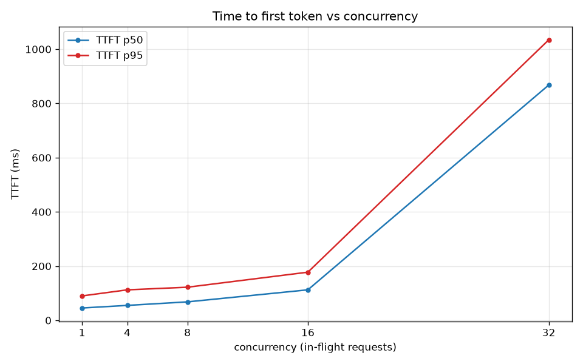
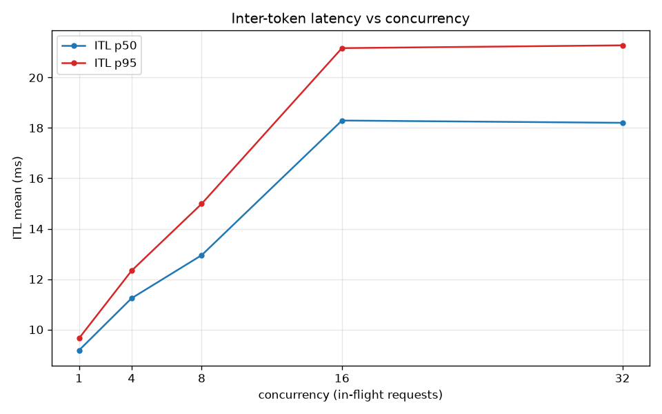
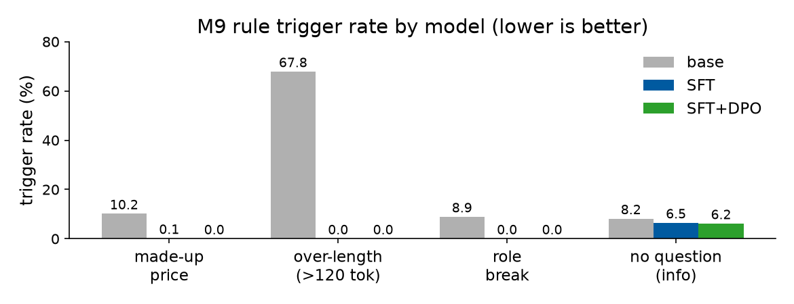
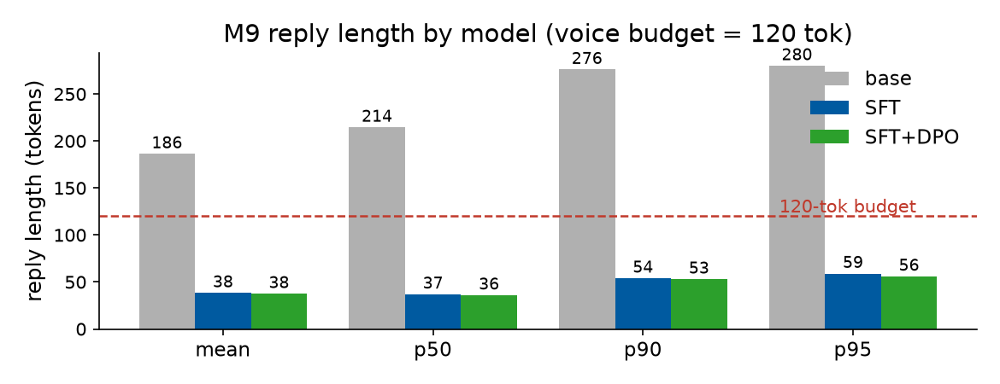
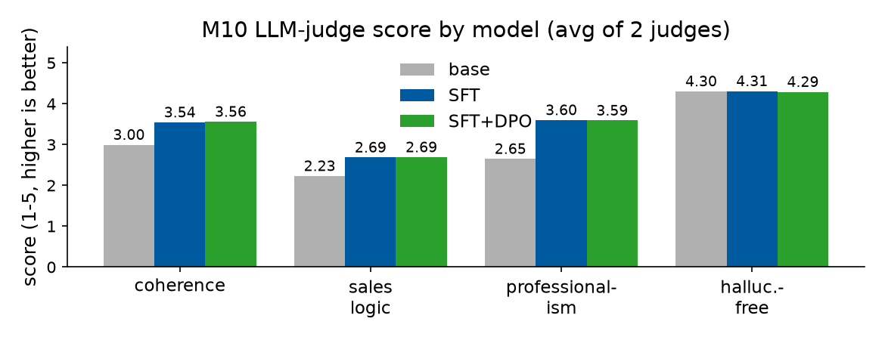

# Technical Report — ABC Energy Voice AI Sales Agent

This report answers the ABC Energy technical challenge (`mini_test_2.pdf`)
**section by section** — A. Data Engineering, B. Fine-tuning & Alignment,
C. Quantization & Serving, D. Evaluation & QA, and the Bonus challenges. Each
subsection states what the challenge asked and how this pipeline answers it, with
the real result and its source file.

**Every figure and number below comes from a committed artifact under `reports/`
or `data/`** (manifests, summaries, CSVs, cost reports) — none are hand-typed
estimates. Engineering choices, run instructions, and the full honest-disclosure
list live in the top-level [`README.md`](../README.md); the slide deck under
`doc/presentation/` presents A–D visually. This report is the written, data-backed
walk-through of the whole challenge (A-D).

> **Hardware context (read every number in this light).** Training (M4 SFT / M5
> DPO) ran on an **A100 40GB in bf16**; quantization (M7), serving (M8), and all
> on-endpoint evaluation/benchmarks (M9/M10/M11) ran on a single **RTX 4070 12GB**
> that also drives a display (~4GB), leaving ~7.9GB usable. The 4070 path for
> training was a connectivity smoke only.

Pipeline: raw sales logs → normalize (M1) + synthesize (M2) → leak-free stratified
split (M3) → SFT `Qwen3-4B-Instruct-2507` LoRA r32/α64 (M4) → DPO (M5) → merge to
dense BF16 (M6) → AWQ INT4 / compressed-tensors W4A16 (M7) → vLLM serving (M8) →
offline rule eval (M9) + LLM-judge (M10) → Locust load test (M11).

---

# A. Data Engineering & Pipeline

## A.1 Normalization

**Requirement:** process raw sales conversation logs (e.g. Alpaca or ShareGPT) into
clean, multi-turn `messages`.

**Answer.** [`scripts/data/normalize.py`](../scripts/data/normalize.py) converts every supported layout
(Alpaca, ShareGPT, and a `prefixed_pairs` adapter for the public dataset) into one
`DialogueRecord` contract (`messages: [{role, content}]`), then runs a fixed
5-step cleaning chain (drop empty/too-short turns → drop non-English → mask PII →
truncate trailing non-assistant turns → exact dedup) and a keyword scenario tag.

Source: `data/interim/normalize_report.json`, `data/README.md`.

| step | count |
|---|---:|
| raw rows (`goendalf666/sales-conversations`) | 3,412 |
| exploded single-turn pairs | 20,927 |
| **clean records written** | **20,732** |
| dropped — duplicate | 192 |
| dropped — non-English | 3 |
| PII replacements | 2 |

**100% of the 20,732 records pass `validate_dialogue()`.** The catch with this
public dataset: each row *looks* multi-turn, but the turns **jump topic**. Here is an example in the collected dataset:

> - **Customer:** "…interested in a new **smartphone**…"
> - **Salesman:** "Of course, I'd be happy to assist…"
> - **Customer:** "I'm looking for a **laptop** for graphic design…"
> - **Salesman:** "Absolutely!…"
> - **Customer:** "I'm upgrading my company's **server**…"

Train on this as-is and the model learns to ignore the conversation so far, which is the
opposite of what a sales agent needs. So each row is split into independent
single-turn dialogues (clean single-turn data from real data). Coherent multi-turn
dialogues come from synthesis (A.2, LLM-generated, coherent by design), and both
mix cleanly under the same output contract. Keyword tagging leaves ~94% as
`general` on this generic corpus — accurate scenario labels arrive with the
synthetic data.

## A.2 Synthesis

**Requirement:** demonstrate how you would programmatically generate or augment data
for common sales scenarios such as objection handling and information gathering.

**Answer.** [`scripts/data/synthesize.py`](../scripts/data/synthesize.py) builds a task matrix (5 scenarios ×
6 personas × 6 objection types × 3 outcomes), quota-samples it, generates by `gemini-2.5-flash` via
OpenRouter with 1–2 few-shot seeds out of 24 high quality seeds generated by a stronger model `gemini-3.5-flash` and validated by an expert, and passes every record through a generation-side quality gate (JSON parse → Pydantic schema → min-turns →
role alternation → **no-price regex** → chosen/rejected divergence for pairs;
≤2 regenerations then abandon). A hard rule: the agent may **never quote a price**,
enforced at generation time.

Source: `data/interim/dialogues_cost_report.json`,
`data/interim/preferences_cost_report.json`.

| product | contract | count | consumed by |
|---|---|---:|---|
| multi-turn dialogues | `DialogueRecord` | **4,351** | M4 SFT |
| preference pairs | `PreferencePair` (chosen/rejected) | **300** | M5 DPO |

Scenario mix of the 4,351 dialogues: objection_handling 1,445 + info_gathering
1,335 = **~64%** (the scenarios that matter), then cold_open 600, closing 578,
general 393. Preference pairs: pushy 150 / rate_hallucination 150.

**Cost**:

| run | records | est. cost |
|---|---:|---:|
| dialogues (batch A $3.42 + batch B $7.32) | 4,351 | $10.74 |
| preference pairs | 300 | $0.22 |
| **total** | | **≈ $10.96** |

## A.3 Validation

**Requirement:** split into train/val/test with **no data leakage** and a
representative dialogue distribution.

**Answer.** [`scripts/data/split.py`](../scripts/data/split.py) merges M1∪M2, removes exact and
near-duplicates **globally before** splitting (MinHash + LSH at Jaccard ≥ 0.85, so
near-identical dialogues can never land in two sets — leakage prevented by
construction), downsamples the generic M1 corpus to **2:1** vs M2 (high-value
objection/info and energy-keyword dialogues always kept), splits **by whole
dialogue** 90/5/5 stratified on `(scenario, turn_bucket)`, then a final assertion
**stops the run (exit 2)** on any cross-split overlap.

Source: `data/processed/split_report.json`.

| pipeline | value |
|---|---:|
| merged M1∪M2 | 25,083 |
| exact dups removed | 0 |
| near-dups removed (LSH) | 24 |
| M1 after dedup → downsampled final | 20,708 → 8,702 |
| M2 (never downsampled) | 4,351 |
| **train / val / test** | **11,748 / 655 / 650** |
| **`cross_split_dups`** | **0** |
| M1:M2 ratio | 2.00 |

Per-scenario shares match across the three splits within **~0.5 percentage points**
(0 distribution warnings at the >3pp threshold) — representative by construction.

---

# B. Fine-tuning & Alignment (SFT / DPO)

## B.1 Supervised Fine-tuning

**Requirement:** a scalable training script (Unsloth / TRL / similar); we want your
choice of hyperparameters (LoRA rank, alpha, learning rate) and memory-efficiency
management.

**Answer.** One config-driven Unsloth + TRL `SFTTrainer` script with
completion-only masking, runnable on both cards by a YAML swap.

Source: `reports/training/sft_manifest.json`, `sft_hparam_sweep.md`, `sft_loss.png`.

**Why these starting hyperparameters.** Base model **`Qwen3-4B-Instruct-2507`** —
open weights (Apache-2.0), strong 4B instruction-following, low latency, and
trainable on a 12GB card. The initial values follow established QLoRA practice
(each then sweep-validated below):

| hyperparameter | value | range | why |
|---|---|---|---|
| LoRA rank r | **32** | 8–64 | capacity vs. overfit; r32 > r16 in sweep [1,2] |
| LoRA α | **64** | r–2r | α/r = 2 scaling heuristic [1,4] |
| learning rate | **2e-4** | 1e-4–3e-4 | QLoRA default; 2e-4 > 1e-4 in sweep [2,4] |
| target modules | all attn+MLP | q,v – all | all linear layers (match full-FT) [2] |
| quantization | 4-bit NF4 | — | frozen 4-bit base + bf16 LoRA [2] |
| LoRA dropout | 0 | 0–0.1 | 0 enables Unsloth's fused path [4] |
| epochs | 2 | 1–3 | >3 over-fits; val flat at 2 |
| effective batch | 16 | 16–32 | grad-accum (fit VRAM); cosine lr, 5% warmup |
| max seq. length | 2048 | 1k–4k | main VRAM lever |
| optimizer | 8-bit AdamW | — | quarters optimizer-state VRAM [3] |

[1] Hu et al., *LoRA*, ICLR 2022. [2] Dettmers et al., *QLoRA*, NeurIPS 2023.
[3] Dettmers et al., *8-bit Optimizers*, ICLR 2022. [4] Unsloth docs.
[5] Qwen Team, *Qwen3 Technical Report*, 2025.

The capacity/precision knobs (rank, α, learning rate) are not left to defaults —
they were swept directly.

A very simple **hyperparameters tuning** is also conducted: (0.4 epoch/combo, α = 2·rank, on the
655-dialogue val set):

| LoRA r | alpha | lr | best val loss |
|---:|---:|---:|---:|
| **32** | **64** | **2e-4** | **0.9496** (chosen) |
| 16 | 32 | 2e-4 | 0.9720 |
| 32 | 64 | 1e-4 | 0.9831 |
| 16 | 32 | 1e-4 | 1.0121 |

r32 > r16 and lr2e-4 > lr1e-4 at every point → **r32 / α64 / lr2e-4** (all 7
attention+MLP projections, dropout 0, 2 epochs, effective batch 16, max_seq 2048,
cosine lr). Final run: 11,748 examples, 1,470 steps, 66M trainable params (1.62%),
**train loss 0.873 / val loss 0.837** — flat val tail, small train-val gap →
generalizes with minimal overfit.

**Memory efficiency — one script, two configs.** The same recipe runs at 12GB and
40GB; only the memory/throughput knobs change:

| knob | 4070 / 12GB | A100 / 40GB | why |
|---|---|---|---|
| `load_in_4bit` | true (NF4) | false (bf16) | 12GB must quantize to fit; 40GB holds bf16 |
| micro-batch × grad-accum | 2 × 8 | 16 × 1 | same effective batch 16 |
| `optim` | adamw_8bit | adamw_torch | 8-bit optimizer cuts state VRAM to ¼ at 12GB |
| `torch_compile` | off | on | spare 40GB compute → +10–15% speed |
| **measured peak VRAM** | **7.23 GB** | **17.0 GB** | — |

So a 4B model is trainable on a 12GB card (4-bit QLoRA, peak 7.23GB, under a 10GB
budget); on the A100 the spare memory buys speed. (The full results above are the
A100 bf16 run — the 4070 served as the connectivity smoke. See README §7 on the
4070 7.23GB smoke artifact provenance.)

## B.2 Alignment (DPO)

**Requirement:** if the model becomes too "pushy" or hallucinates energy rates,
demonstrate DPO to align behavior with professional sales ethics.

**Answer.** Continue-train the SFT adapter on 300 preference pairs (pushy
150 / rate-hallucination 150) with a **two-adapter reference** — one bf16 base
carries a trainable *policy* and a frozen *reference* adapter (both from SFT), so
the KL anchor is the SFT model with **no second full model** in VRAM.

Source: `reports/training/dpo_manifest.json`, `dpo_behavior_diff.md`,
`dpo_margins.png`, `dpo_loss.png`.

| loss | reward margins |
|---|---|
|  |  |

**The training objective converged cleanly:** reward margin (chosen − rejected)
**0 → +1.157**, reward accuracy **1.00** (β 0.1, lr 5e-6, 1 epoch, 19 steps, peak
27.9GB). It is **suppression-driven** — the policy mainly learns *not* to emit the
pushy / invented-rate reply.

**Behaviour change is honestly modest.** Of 20 held-out adversarial probes (greedy,
before-SFT vs after-DPO), only **5/20** continuations changed, mostly wording. Of
the 15 unchanged, ~13 were already grounded/non-pushy (a correct no-op) and **one
is a true residual** ("Yes, our standing charge is 25 pence a day" survived DPO).
SFT was already well-aligned, so DPO had little to fix — a finding that the M9 rule
metrics and M10 judges independently confirm (Section D).

## B.3 Adapter Management (merge)

**Requirement:** a script to merge LoRA adapters into dense weights for
production-ready serving.

**Answer.** [`scripts/training/merge_adapter.py`](../scripts/training/merge_adapter.py) bf16-loads the base and
`merge_and_unload`s the DPO adapter into a standalone HF model
(safetensors + tokenizer + chat template), then proves the merge is
behaviour-preserving with an 8-prompt greedy consistency check (exit 2 + diff on
mismatch).

Source: `reports/training/merge_consistency.md`.

**Result: PASS — 8/8 prompts byte-identical** between `base + DPO adapter` and the
merged dense model (8.045 GB). Nothing is lost in the merge; M7 quantizes a
faithful model.

---

# C. Quantization & High-Performance Serving

## C.1 Quantization (AWQ INT4)

**Requirement:** implement/document a PTQ process (NVFP4 / AWQ / GGUF) and explain
the trade-off between model size and inference latency (TTFT / ITL).

**Answer.** AWQ **W4A16** (weights 4-bit, activations 16-bit), asymmetric,
group_size 128, `ignore=[lm_head]`, via `llm-compressor`. Calibrated on 256
scenario-stratified samples from our own `train.jsonl`. Run on the 4070 with
`device_map=cpu` + **sequential per-block** quantization (one decoder block on the
GPU at a time; a naive `.to("cuda")` would OOM). Output is **compressed-tensors /
pack-quantized** (vLLM auto-detects; not legacy AutoAWQ).

Source: `reports/training/quant_manifest.json`, `quant_report.md`.

| | bytes | GB |
|---|---:|---:|
| FP16 (merged) | 8,044,981,992 | 8.045 |
| INT4 (AWQ) | 2,666,063,024 | 2.666 |

**3.018× smaller, −66.86%.** (Short of a full 4× because group scales/zero-points
and the 16-bit `lm_head`/non-Linear layers remain.) Quality: 5 FP16-vs-INT4 greedy
probes show **no visible regression**.

**The size ↔ latency trade-off (TTFT / ITL).** The two latency phases move
*asymmetrically*:

- **Decode (ITL)** emits one token per step and is **memory-bandwidth-bound**: time
  ≈ weight-bytes-read / bandwidth. 4-bit weights are ~¼ the bytes → **ITL drops** —
  the headline win for a streaming voice agent.
- **Prefill (TTFT)** processes the whole prompt at once and is **compute-bound** on
  FP16 tensor cores. W4A16 *dequantizes* 4-bit→16-bit before the same FP16 GEMM (no
  FLOP cut) plus dequant overhead → **TTFT flat / slightly worse**.

Net: a voice agent streams tokens, so **ITL dominates perceived latency**, exactly
what W4A16 optimizes, and the freed VRAM buys KV-cache headroom for concurrency.
(Why AWQ and not the alternatives: GGUF is llama.cpp/CPU-first, not vLLM's native
GPU path; **NVFP4 needs Blackwell FP4 tensor cores and the 4070 is Ada** — see
Bonus 2.)

## C.2 Serving on 12GB (vLLM) + continuous batching

**Requirement:** deploy with a high-throughput engine (e.g. vLLM); the setup should
handle multiple concurrent requests effectively.

**Answer.** Official `vllm/vllm-openai:v0.10.2` image, OpenAI-compatible API,
tuned for the 4070: `gpu_memory_utilization 0.55` (~6.6GB plan; the card also drives
the display), `max_model_len 3072`, `max_num_seqs 16`, prefix caching,
`--reasoning-parser qwen3` (strips the empty `<think>` prefix), and **no
`--quantization` flag** (compressed-tensors auto-detected). Full config and the
[`patch_quant_config.py`](../scripts/serving/patch_quant_config.py) workaround: README §5.

**Why 0.55 / 3072 / 16 (not the design defaults 0.90 / 4096 / 32).** The 4070 also
drives the display, so real free VRAM was ~7.9GB, not a clean server-style 12GB.

- `gpu_memory_utilization = 0.55` → vLLM plans around 12GB × 0.55 ≈ **6.6GB**,
  leaving room for CUDA/vLLM workspace, the display, startup peaks, and
  fragmentation (the default 0.90 fights the display and OOMs).
- `max_model_len = 3072` caps how much KV cache **one request** can consume.
- `max_num_seqs = 16` caps how many active sequences vLLM may schedule **at once**.
- KV cache grows ≈ context length × active sequences, so 4096 × 32 was too
  aggressive together; **3072 × 16** is the stable point that still proves the
  required 16-way concurrency. Measured steady state: vLLM ~6.6GB + display ~1.8GB,
  with headroom left.

Source: `reports/serving/concurrency_demo.md`.

**Continuous-batching demo — 16 concurrent streaming requests:**

| metric | value |
|---|---|
| warm single-request latency | 0.468 s |
| serial estimate (16×) | 7.484 s |
| **concurrent wall-clock (16 streams)** | **0.739 s** |
| **latency speedup** | **10.13×** |
| aggregate output throughput | **917 tok/s** |
| throughput gain vs single stream | **9.13×** |
| TTFT p50 (with prefix caching) | 0.106 s |

**What the seconds mean.** A single warm request takes **0.468 s**; 16 run
one-after-another would be ~**7.484 s** (16 × 0.468); vLLM served all **16 streams in
0.739 s** wall-clock — a **10.13× latency speedup** at **917 tok/s**. Mean TTFT is
~**0.10 s**, so the first visible token appears almost immediately. The reading: if
vLLM were effectively serial 16 requests would take ~7.5 s (a stalled-feeling call),
but finishing in 0.74 s means the streams were scheduled together during decode — a
still-conversational window, and the continuous batching the requirement asked us to
demonstrate.

## C.3 Inference benchmarks — throughput vs latency (Locust ladder)

This is the **Performance Report** deliverable's "throughput vs latency": a Locust
closed-loop ladder `[1, 4, 8, 16, 32]` against the INT4 endpoint. **0% error across
all tiers, no OOM / no crash.**

Source: `reports/bench/bench_summary.csv`, `bench_report.md`, and the three PNGs.

| concurrency | TTFT p50 (ms) | TTFT p95 (ms) | ITL p50 (ms) | tok/s | error % |
|---:|---:|---:|---:|---:|---:|
| 1 | 45.6 | 90.1 | 9.2 | 102.1 | 0.0 |
| 4 | 55.2 | 112.5 | 11.2 | 334.2 | 0.0 |
| 8 | 68.2 | 122.2 | 13.0 | 575.9 | 0.0 |
| 16 | 112.6 | 177.7 | 18.3 | 820.2 | 0.0 |
| 32 | 867.7 | 1034.3 | 18.2 | 835.3 | 0.0 |

**Reading the columns.** *concurrency* = simultaneous closed-loop clients (no
think-time, so in-flight load ≈ N); *TTFT* = time to the **first** token (p50 median /
p95 tail) — how fast the agent starts replying; *ITL* = gap between streamed tokens —
how fast the reply types out; *tok/s* = aggregate output throughput across all active
streams.

| throughput | TTFT | ITL |
|---|---|---|
|  |  |  |

**Two regimes, knee at 16→32.** Up to 16, continuous batching packs more requests
into each GPU step, so **throughput scales near-linearly** (102 → 820 tok/s) while
TTFT rises only modestly (46 → 113 ms) and ITL stays low (9 → 18 ms) — more
concurrency, almost free. At 32 the load exceeds `max_num_seqs=16`, so half the
requests **queue for a scheduling slot**: throughput **plateaus** (820 → 835 tok/s,
the GPU is already saturated) and **TTFT explodes** (p50 113 → 868 ms, p95 →
1034 ms), while **ITL stays flat (~18 ms)** — once a request is actually running its
per-token speed is unaffected; the entire cost of overload lands on *waiting to
start* (TTFT), not on decode (ITL). This empirically locates the 12GB concurrency
ceiling: past the serving cap you no longer buy throughput, only latency.

**How this relates to C.2.** C.2 is a one-shot *existence proof* — fire 16 streams
once and show batching beats serial (10.13× speedup, 917 tok/s). C.3 is the
*characterization* — a sustained ladder that maps the latency↔throughput curve and
finds the knee. The two agree at 16 concurrency (C.2 mean TTFT ~100 ms / 917 tok/s
vs C.3 p50 113 ms / 820 tok/s); the small gap is method, not contradiction: C.2 is a
short burst with heavy prefix-cache hits reported as a **mean**, while C.3 is
steady-state, mixed-length load reported as **percentiles** — so C.3 also exposes the
p95 tail and a more honest sustained throughput.

> **FP16-vs-INT4 latency gap (disclosed, not measured):** the 8.045GB FP16 model
> does not fit alongside the display on the 4070 (~7.9GB free), so only INT4 was
> benchmarked. The FP16↔INT4 comparison rests on **size** (C.1: 3.018×) and
> **quality** (C.1: 5 probes), not a TTFT/ITL A/B. Real, recorded gap
> (`bench_report.md`).

## C.4 Resource management (isolation)

**Requirement:** explain how you would isolate training and inference workloads for
stable performance on a shared GPU.

**Answer (this project): time-slicing.** Training/quantization and serving
never run concurrently on the single 4070; the quant/serve/eval/bench stages run
**serially** so benchmark numbers are not distorted. If they must co-reside, the
operational rule is: **serving owns a fixed latency budget first**
(`gpu_memory_utilization`, `max_num_seqs`), then training adapts to the leftover via
smaller micro-batches / shorter `max_seq_length` / scheduled pauses — never by
stealing vLLM memory. Production options (MIG hard partitioning, MPS, per-process
memory fractions, K8s device plugins) and the 1,000-session scaling blueprint are
worked out in **Bonus 1** ([`Bonus/bonus1_capacity/`](../Bonus/bonus1_capacity/)).
See also README §6.

---

# D. Evaluation & Quality Assurance

## D.1 Automated offline evaluation (rule metrics)

**Requirement:** an offline evaluation loop that processes a test set and computes
key metrics.

**Answer.** [`scripts/eval/run_offline_eval.py`](../scripts/eval/run_offline_eval.py) generates over the **same 650
test dialogues** for all three model groups via the vLLM endpoint (temperature 0,
max_tokens 256), then computes four deterministic rule metrics. The same batch +
params make the three groups directly comparable. p50 (50th percentile length) is reported alongside the mean.

Source: `reports/eval_offline/comparison.md`, `eval_offline/{base,sft,dpo}/summary.json`.

| rule (lower is better) | base | sft | dpo |
|---|---:|---:|---:|
| made_up_price | 10.15% | 0.15% | **0.00%** |
| over_length (>120 tok) | 67.85% | 0.00% | 0.00% |
| role_break | 8.92% | 0.00% | 0.00% |
| no_question_in_gathering | 8.15% | 6.46% | 6.15% |

*The **120-token budget** is the maximum length for a voice reply (spoken answers must
be short, proposal §4-D1); the `over_length` rule flags any reply above it.*

| reply length (tokens) | base | sft | dpo |
|---|---:|---:|---:|
| mean | 186.28 | 38.36 | 37.52 |
| p50 | 214.5 | 37.0 | 36.0 |

| rule trigger rate | reply length |
|---|---|
|  |  |

*Figures generated by [`scripts/eval/plot_eval.py`](../scripts/eval/plot_eval.py) from
the per-group `summary.json`. Rule rates are over all 650 replies; for `no_question`
the within-info-gathering rate is 64.6 → 51.2 → 48.8% (base/SFT/DPO).*

**SFT does the heavy lifting** — it collapses verbosity (p50 214.5→37 tokens),
zeroes over-length and role-break, and cuts price hallucination 10.15%→0.15%.
**DPO nudges further but mildly** (removes the last price violation; small
length/question gains) — consistent with the B.2 probes.

## D.2 LLM-as-a-Judge

**Requirement:** design a "Referee" prompt using a stronger model to grade dialogue
coherence and sales logic.

**Answer.** [`scripts/eval/run_judge.py`](../scripts/eval/run_judge.py) scores the same 100 ids/group (M9
outputs), blind (judge never sees the model tag), on four 1–5 dimensions
(coherence, sales_logic, professionalism, hallucination-free). We use **two
non-Google judges** — `anthropic/claude-sonnet-4.6` + `openai/gpt-5.4` — chosen to
differ in family from both the synthesizer (`gemini-2.5-flash`) and the models under
test (Qwen), avoiding same-source bias. **600/600 scored, 0 parse failures.**

"Same 100 ids/group" means all three models are judged on the **identical** 100
dialogue contexts (a scenario-stratified, seed-42 subset of M9's 650-id test pool),
so score gaps reflect the **model**, not which prompts each group happened to get.
**Why 100:** a cost-vs-representativeness budget (proposal §4-D2) — 100/group × 3
groups × 2 judges = 600 paid judge calls = $4.20; scoring all 650 would be ~6.5× the
cost for no change in the conclusion, and 100 stratified + seeded is enough to detect
the effects and stay reproducible.

Source: `reports/eval_judge/comparison.md`, `aggregate.json`, `manifest.json`.

| dimension | judge | base | sft | dpo | base→sft | sft→dpo |
|---|---|---:|---:|---:|---:|---:|
| professionalism | claude | 2.48 | 3.40 | 3.38 | **+0.92** | +0.02 (n.s.) |
| professionalism | gpt | 2.82 | 3.80 | 3.80 | **+0.98** | +0.00 (n.s.) |
| coherence | claude | 2.95 | 3.44 | 3.43 | **+0.49** | +0.01 (n.s.) |
| coherence | gpt | 3.04 | 3.65 | 3.69 | **+0.61** | −0.04 (n.s.) |
| sales_logic | claude | 2.27 | 2.69 | 2.64 | **+0.42** | +0.05 (n.s.) |
| sales_logic | gpt | 2.19 | 2.68 | 2.74 | **+0.49** | −0.06 (n.s.) |
| hallucination | claude | 4.11 | 4.28 | 4.22 | +0.17 (n.s.) | +0.06 (n.s.) |
| hallucination | gpt | 4.50 | 4.34 | 4.36 | −0.16 (n.s.) | −0.02 (n.s.) |

*Average of the two judges' overall means (per-judge values in the table above);
generated by [`scripts/eval/plot_eval.py`](../scripts/eval/plot_eval.py).*

**Both judges independently agree:** base→SFT is a large, real gain
(professionalism ≈ +0.9–1.0, coherence ≈ +0.5–0.6, sales_logic ≈ +0.4–0.5);
**SFT→DPO shows no significant difference (gap < 0.3) on any dimension** — matching
the M9 rule metrics and B.2 probes. The judges did not award DPO a spurious bonus.
**Judge cost: $4.1979** (claude $2.39 + gpt $1.81).

**On the hallucination-free dimension** (gpt scores base 4.50 but SFT/DPO 4.34/4.36 —
a small apparent *drop*): this is the **only** dimension where the two judges disagree
in sign (claude base→sft **+0.17**, gpt **−0.16**), both below the 0.3 threshold —
i.e. **noise, not a real rise in hallucination**. The trustworthy signal is M9's
deterministic `made_up_price` (**10.15% → 0.15% → 0%**, a large drop). The base scores
high here mainly by giving long, generic, often role-breaking replies that commit to
few concrete claims, so a holistic 1–5 judge reads them as "invented nothing" (already
near the ceiling, little room to rise); the judge dimension is broad/subjective while
the M9 rule is narrow/objective.

---

# Bonus Challenges (challenge §3)

All three bonuses are **implemented** under `Bonus/` (each with its own README, code,
and committed results); the numbers below come from those artifacts.

## Bonus 1 — High-concurrency: can one A100 host 1,000 sessions?

**Requirement:** a blueprint for 1,000+ concurrent voice sessions, the KV-cache strategy, and
how to minimise TTFT (PagedAttention / speculative decoding).

**Answer:** A pure-arithmetic KV-cache sizing analysis is in
[`Bonus/bonus1_capacity/`](../Bonus/bonus1_capacity/): the script
`kv_capacity_calc.py` reads the served model's `config.json` together with the M7/M11
numbers and computes how much KV-cache each session needs. Every token stores
KV = 36 layers × 2 (K,V) × 8 KV-heads × 128 head-dim × 2 B = **144 KiB/token**, where
grouped-query attention (GQA) holds the KV heads at 8 — a 4× saving versus full
multi-head attention.

Here is the analysis results:

| regime | result |
|---|---|
| worst case (all 1,000 hold full context) | one A100 40GB fits **~112 @2k / ~56 @4k** → **~9 / ~18 A100s** for 1,000 |
| realistic voice (~15% duty cycle, ~512 live tok, prefix cache) | KV demand ≈ **10.5 GiB** (fits ~3× over) → **throughput-bound, not memory**: ~3,200 tok/s ⇒ **~1 A100 (~2 with High Availability)** |

**KV cache confirmed in use** (no code change needed — the brief says implement only if it
*weren't*): vLLM is PagedAttention by default + `--enable-prefix-caching`; evidenced by M8
continuous batching (10.1×, flat ~0.1 s TTFT from prefix reuse) and the M11 16→32 knee (a
bounded paged pool).

**Analysis:** for a voice workload the binding constraint is **throughput, not KV memory**,
so the blueprint scales replicas by SLO (TTFT-p95 / KV-utilisation) behind a gateway, with
prefix caching + right-sized `max_model_len` + optional speculative decoding doing the work.

## Bonus 2 — Precision-loss-aware PTQ (advanced path) + smoke test

**Requirement:** an advanced PTQ path beyond standard 4-bit (NVFP4 / Model Optimizer), plus a
"smoke test" that the quantized model kept its sales logic / tone vs the FP16 base.

**Answer:** ([`Bonus/bonus2_quant/`](../Bonus/bonus2_quant/)): NVIDIA **Model Optimizer
0.44.0** was run in Docker on the **Ada 4070 (sm89)**. NVFP4 is Blackwell-only, so
FP8 is the hardware-appropriate advanced path on this card. To avoid comparing
8-bit FP8 size against 4-bit AWQ as if they were the same recipe, I also ran a
supplemental **ModelOpt INT4_AWQ** path as the apples-to-apples size baseline.

| path | tool | method | size | compression | serving / smoke |
|---|---|---|---:|---:|---|
| FP16 merged | transformers | dense BF16/FP16 | 8.045 GB | 1.00× | baseline |
| **M7 AWQ INT4** | llm-compressor | W4A16_ASYM/g128 | **2.666 GB** | **3.018×** | vLLM PASS |
| Bonus 2 FP8 | ModelOpt | `FP8_DEFAULT_CFG`, `lm_head` excluded | 4.412 GB | 1.824× | native vLLM PASS |
| Bonus 2 INT4_AWQ | ModelOpt | W4A16_AWQ/g128 | 2.710 GB | 2.969× | vLLM FAIL: unsupported ModelOpt INT4 |

**FP8 advanced path.** Calibrated on 64 stratified training samples (`max_seq_len=768`).
The checkpoint exports as ModelOpt FP8 and vLLM detects `quantization=modelopt`.
Native vLLM load used **4.23 GiB** for weights plus **1.61 GiB** KV cache; the same
5 M7 probes produced non-empty, sales-consistent outputs (**5/5 pass**).

**Fair INT4 size comparison.** ModelOpt `INT4_AWQ_CFG` was calibrated on 32 stratified
samples (`max_seq_len=512`) and exported a 2.710 GB W4A16_AWQ checkpoint, very close
to M7's 2.666 GB compressed-tensors AWQ product. Its fake-quant 5-probe smoke was
non-empty and did not invent rates, but one cold-open response drifted from the energy
sales domain into generic digital marketing. Native vLLM rejected this artifact before
generation because vLLM v0.10.2 supports ModelOpt `FP8` / `NVFP4`, not ModelOpt
`W4A16_AWQ`.

*Why FP8 is **larger** than AWQ: FP8 stores each weight in **8 bits** vs INT4's **4 bits**,
so the quantized weights are ~2× the bytes (the non-quantized `lm_head`/embeddings are
16-bit in both). FP8 trades that extra size for a floating-point format with native Ada
Tensor-Core support and better dynamic range — not maximum compression.*

**Analysis:** FP8 is the advanced Ada-specific ModelOpt path and it preserves behaviour
under native vLLM smoke. The fair INT4 comparison shows ModelOpt can reach nearly the
same size as M7 AWQ, but its current vLLM serving support is weaker. Therefore
**M7 AWQ INT4 stays the 12GB deployment choice**, while Bonus 2 documents FP8 as the
hardware-specific advanced route and ModelOpt INT4 as a size-comparable but non-deployable
comparison on this stack.

## Bonus 3 — Full-stack observability & benchmarking

**Asked:** automated benchmarking (Locust) + tracing (Langfuse / W&B) of multi-turn
"reasoning traces" to localise where the model fails in a dialogue.

**Done** ([`Bonus/bonus3_observability/`](../Bonus/bonus3_observability/)):
- **3a benchmarking** — already shipped as M11 (C.3); cited here, not re-run.
- **3b tracing** — a **Langfuse** integration (chosen over W&B: one trace per conversation,
  one generation per turn) with a local JSONL/HTML fallback. The demo runs 3 multi-turn
  sales conversations against the M8 endpoint, recording prompt / content /
  `reasoning_content` / latency / usage / M9 rule-flags / failure annotation.

**Result — failure localisation:** across 3 conversations / 7 assistant turns it pinpointed
**1 failure turn** — `conv-adversarial-no-question`, turn 2, `info_gathering`, rule
`no_question_in_gathering`, 331.6 ms. The trace shows a **multi-turn instruction-following
conflict** (the user pressured "no question marks", so the model gave a proposal instead of
a discovery question) — not latency, not a parser artifact, not price hallucination.

**Analysis:** the trace makes a multi-turn failure precisely attributable to a
turn + dimension + rule — exactly what production observability needs. (`reasoning_content`
was null throughout, consistent with M8's qwen3 parser stripping the empty `<think>`.)

---

# Appendix — report-map coverage (design §5.3)

| §5.3 report item | section | source file(s) |
|---|---|---|
| SFT/DPO loss curves | B.1 | `training/sft_loss.png`, `dpo_loss.png`, manifests |
| DPO pre/post behaviour diff | B.2 | `training/dpo_behavior_diff.md`, `dpo_margins.png` |
| Model size FP16 vs INT4 | C.1 | `training/quant_manifest.json`, `quant_report.md` |
| TTFT/ITL/throughput vs concurrency | C.3 | `bench/bench_summary.csv` + 3 PNGs |
| Rule-metric trigger rates | D.1 | `eval_offline/comparison.md` + 3 `summary.json` |
| Judge four-dimension comparison | D.2 | `eval_judge/comparison.md`, `aggregate.json` |

Supporting evidence beyond the §5.3 map: data-engineering counts (A.1–A.3), merge
consistency (B.3), and the M8 continuous-batching demo (C.2).
