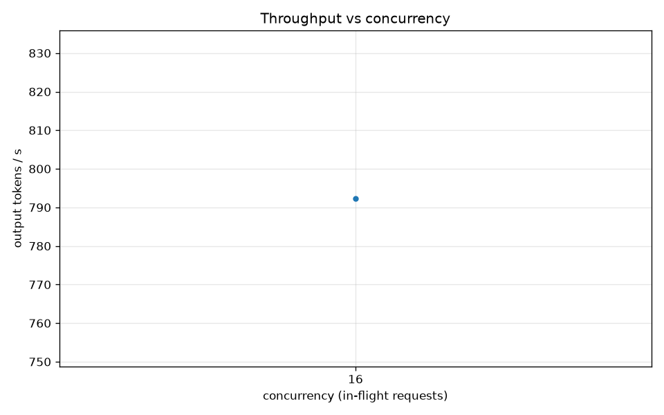
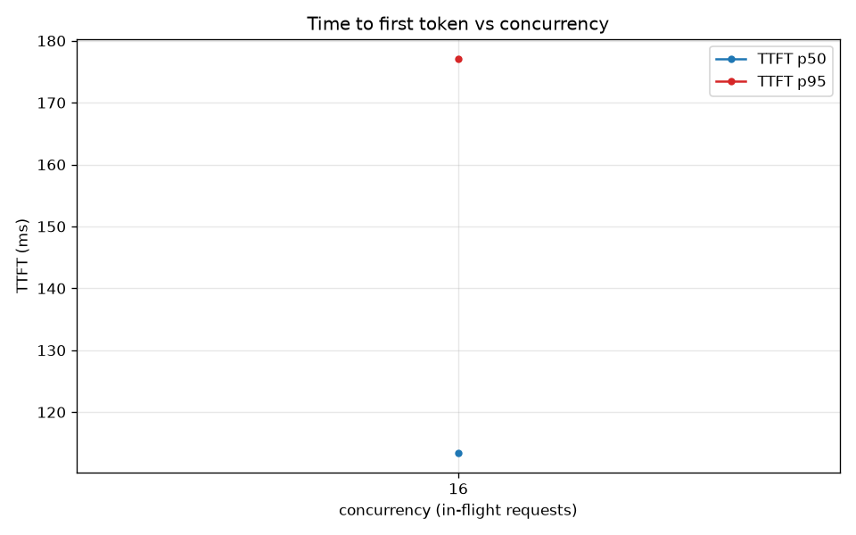
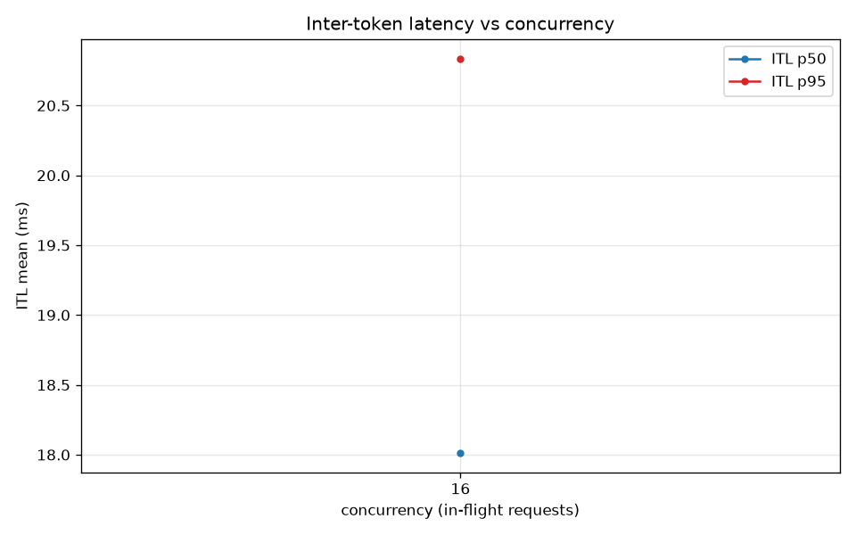

# M11 load test (Locust, AWQ/INT4) -- SMOKE

- endpoint: `http://127.0.0.1:8000` | served INT4 (compressed-tensors) on RTX 4070, M8 service
- generated_at: 2026-06-15T08:51:31

## Steady-state metrics vs concurrency

| concurrency | TTFT p50 (ms) | TTFT p95 (ms) | ITL p50 (ms) | ITL p95 (ms) | tok/s | req/s | error % | n |
|---:|---:|---:|---:|---:|---:|---:|---:|---:|
| 16 | 113.4 | 177.1 | 18.0 | 20.8 | 792.4 | 19.00 | 0.0 | 475 |

## Plots

- 
- 
- 

## Notes

- Concurrency is closed-loop (N users, no think-time) so in-flight load ~= N. 32 exceeds the M8 cap max_num_seqs=16 on purpose: vLLM queues past 16, so the 16->32 step is where TTFT rises and throughput plateaus (the real knee).
- FP16 vs INT4 TTFT/ITL comparison NOT measured: the merged FP16 model (8.045GB) does not fit alongside the display on the 4070 (~7.9GB free), so only the INT4 (AWQ/compressed-tensors) service is benchmarked here. Size/theory comparison: M7 manifest (8.045GB FP16 -> 2.666GB INT4, 3.02x); quality: M7's 5 FP16-vs-INT4 probes (no visible regression). Handed to M12 README.
